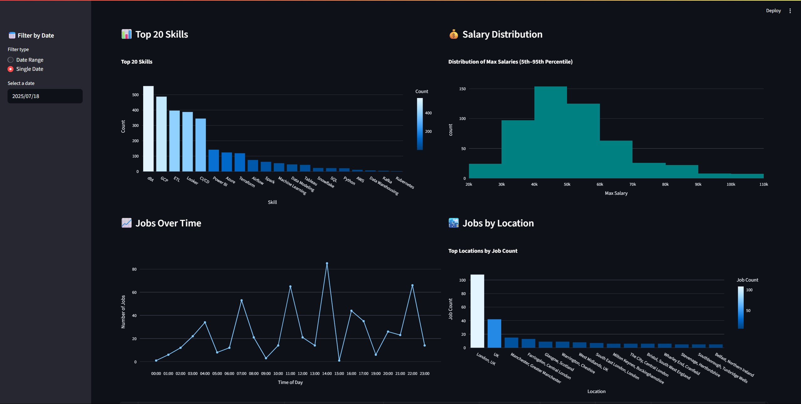
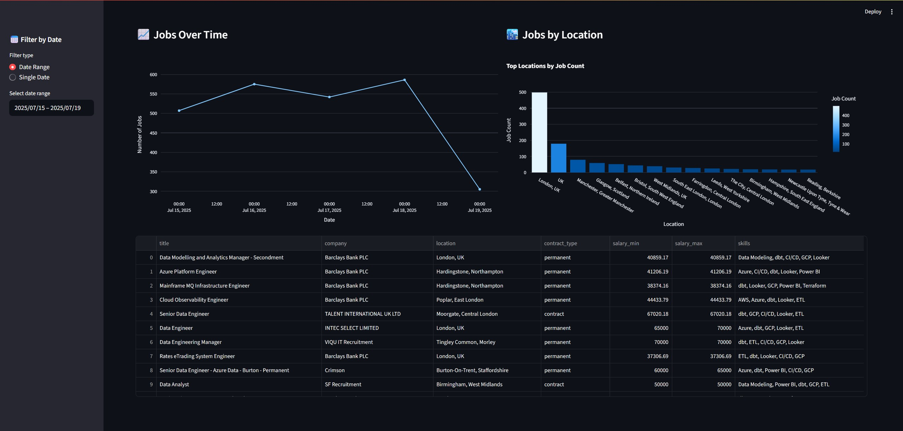

# 📊 UK Job Market Dashboard (Local Version)

An end-to-end data pipeline and interactive dashboard that tracks job market trends in the UK using data pulled from the [Adzuna Job API](https://developer.adzuna.com/).

This version is fully containerized using Docker and includes automated data ingestion with Airflow, storage in PostgreSQL, and visual exploration using Streamlit.

> 🚧 This is the **local version** of the project. A **cloud-deployed version** (with hosted database + public dashboard) is currently in progress.

---

## 🎯 Project Objectives

- Fetch real-time job listing data via Adzuna API
- Extract and transform data into analysis-ready format
- Automatically load enriched job data into PostgreSQL
- Build an interactive dashboard to analyze trends in skills, salary, time, and location
- Orchestrate and automate daily ETL using Apache Airflow

---

## 🛠 Tools & Technologies

| Component         | Technology Used               |
| ----------------- | ----------------------------- |
| **Orchestration** | Docker, Docker Compose        |
| **ETL Workflow**  | Apache Airflow (daily DAG)    |
| **Database**      | PostgreSQL (Docker container) |
| **Dashboard**     | Streamlit                     |
| **Data Access**   | SQLAlchemy, psycopg2-binary   |
| **Visualization** | Plotly, Pandas                |
| **API Source**    | Adzuna Job API                |
| **Dev Tools**     | pgAdmin, VS Code              |

---

## 📦 Project Structure

```
job\_market\_dashboard/
│
├── dags/                      # Airflow DAG scripts
│   └── job\_market\_dag.py
│
├── datasets/                  # Local storage
│   ├── raw/                   # Raw JSON data
│   └── processed/             # Transformed CSV files
│
├── api_client.py
├── dashboard.py
├── jobs_table.py
├── skill_extractor.py
├── skills.py
├── task1.py
├── task2.py
├── utils.py
│
├── docker-compose.yml         # Multi-service Docker setup
├── .env.example               # Sample environment config
└── README.md
```

---

## 🔁 ETL Pipeline (via Airflow)

- **DAG Frequency**: Daily
- **Data Logic**:

  - If run today (e.g., July 20), fetch jobs posted **on July 19**
  - Ensures we don't miss late-day job posts by waiting a day

- **DAG Tasks**:
  1. `fetch_and_save_to_csv`: Pull data from API, parse JSON, transform and save to CSV
  2. `load_csv_to_db`: Load CSV into PostgreSQL and use `facebook/bart-large-mnli` to extract skills

---

## 🧠 PostgreSQL Schema

```sql
CREATE TABLE IF NOT EXISTS jobs (
    job_id VARCHAR(50) PRIMARY KEY,
    title VARCHAR(255),
    company VARCHAR(255),
    contract_type VARCHAR(50),
    contract_time VARCHAR(50),
    created TIMESTAMP,
    location VARCHAR(255),
    category VARCHAR(100),
    salary_min FLOAT,
    salary_max FLOAT,
    skills TEXT,
    description TEXT,
    timestamp TIMESTAMP
);
```

---

## 📊 Dashboard Features (Streamlit)

- 🔍 **Top 20 Skills** by frequency
- 💰 **Max Salary Distribution** (percentile breakdown)
- 🕒 **Jobs Over Time** line chart
- 📍 **Jobs by Location** — top cities by demand
- 📅 Date filter (range or single-date selector)

### 📷 Dashboard Screenshot




---

## ⚙️ Environment Setup

Create your own `.env` file using this template:

```env
# Adzuna API
ADZUNA_APP_ID=your_app_id
ADZUNA_APP_KEY=your_api_key

# Database
DB_USER=postgres
DB_PASSWORD=password
DB_HOST=job-market-db
DB_PORT=5432
DB_NAME=job_market_db
```

---

## 🚀 Running the Project Locally

Make sure Docker & Docker Compose are installed.

```bash
docker-compose up --build
```

- Access **Airflow UI** at: `http://localhost:8080`
- Access **Streamlit Dashboard** at: `http://localhost:8501`

---

## 🔜 Next Steps (In Progress)

- Deploy dashboard to **Streamlit Cloud**
- Move from local Postgres to hosted DB (e.g., Supabase)
- Add scheduled GitHub Actions / DAG monitoring
- Build region/category-level drill-downs

---

## 📝 API Usage Notes

- You need to register at [developer.adzuna.com](https://developer.adzuna.com/) to get your **App ID** and **API Key**
- Place these values in your `.env` file
- Current usage assumes you're fetching UK-based job data only

---

## 📄 License

This project is for educational purposes. Attribution to Adzuna is required if using their API in public-facing products.

---

## 🙌 Acknowledgments

- [Adzuna Job API](https://developer.adzuna.com/)
- [Hugging Face Transformers](https://huggingface.co/facebook/bart-large-mnli)
- OpenAI / ChatGPT for assisting in planning and README generation 😉
